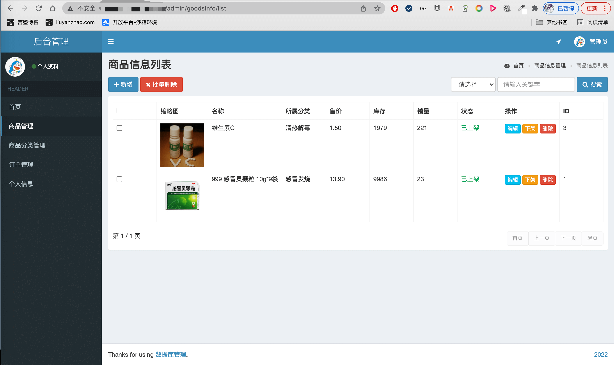
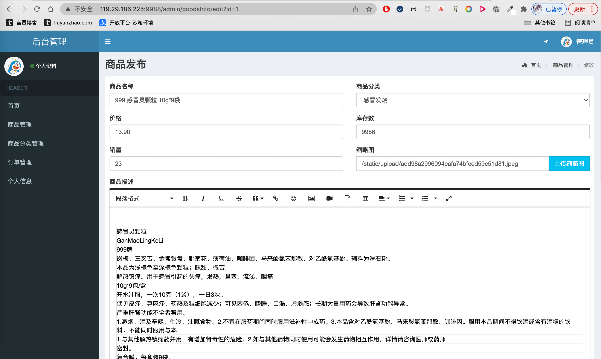
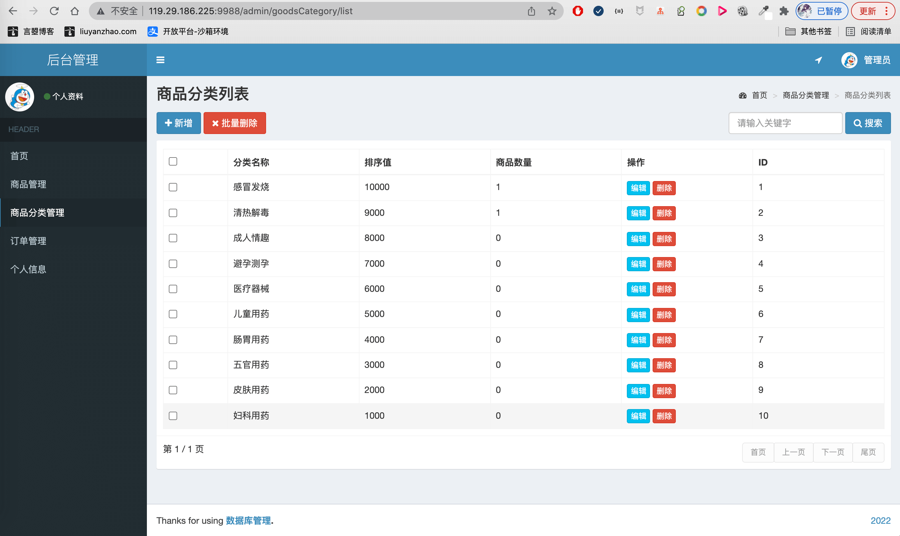
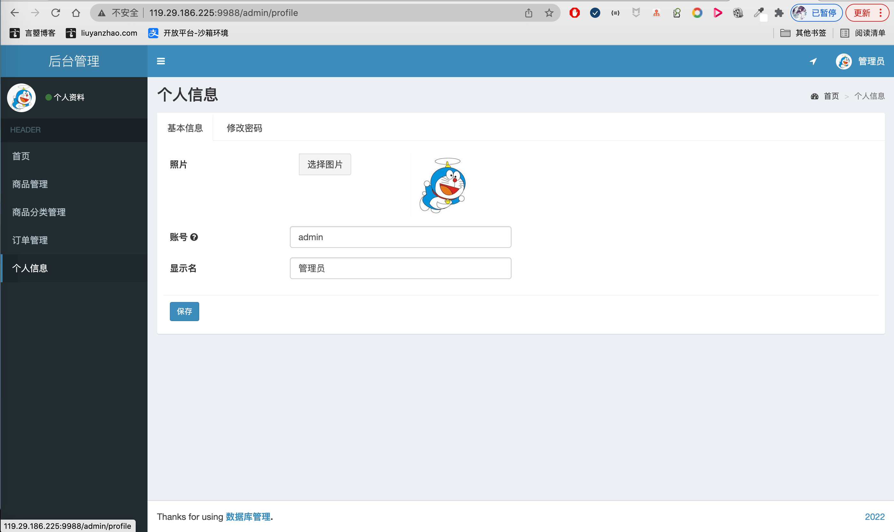
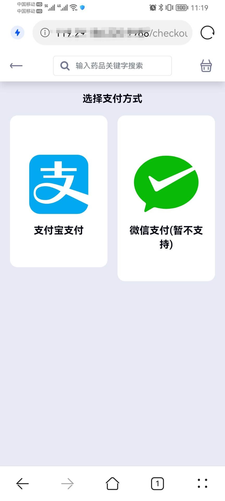

- 基于SpringBoot/SSM的药品售货机平台 H5药品购买平台
- 预览地址：[http://drugvendingmachine.liuyanzhao.com](http://drugvendingmachine.liuyanzhao.com)
- 详细介绍地址：[https://liuyanzhao.com/shop/DrugVendingMachine.html](https://liuyanzhao.com/shop/DrugVendingMachine.html)
- 代码地址：https://github.com/saysky/DrugVendingMachine 或 https://gitee.com/saysky/DrugVendingMachine

# 一、功能介绍
- 管理员功能
    - 药品管理、药品发布编辑、上架、下架
    - 药品分类管理
    - 订单管理、订单详情
    - 管理员个人信息、修改密码
    - 管理员登录
- 顾客功能
    - 药品列表、下拉分页
    - 根据药品分类筛选药品
    - 根据药品名称搜索
    - 药品详情、详细信息、轮播图
    - 添加购物车、编辑购物车、购物车结算
    - 手机支付宝支付或扫码支付

该项目是极为轻量级手机网站(H5)售货机购买平台，类似手机商城

# 二、技术组成
- 1、SpringBoot 或 SSM
- 2、MyBatis
- 3、Thymeleaf
- 4、Bootstrap
- 5、MySQL

# 三、项目截图
1-后台登录.png

2-商品管理.png

3-商品编辑1.png

4-商品编辑2.png

5-商品分类管理.png

7-订单管理.png

8-订单详情.png

9-管理员个人信息.png

10-手机端-售货机首页.jpg

11-手机端-售货机商品列表.png

12-手机端-售货机商品详情.jpg

13-手机端-售货机购物车列表.jpg

14-手机端-售货机支付选择.jpg

15-手机端-售货机手机支付宝支付.jpg

16-手机端-售货机扫码支付(二选一).jpg
.jpg)

# 四、联系方式
需要完整代码联系博主，微信847064370

